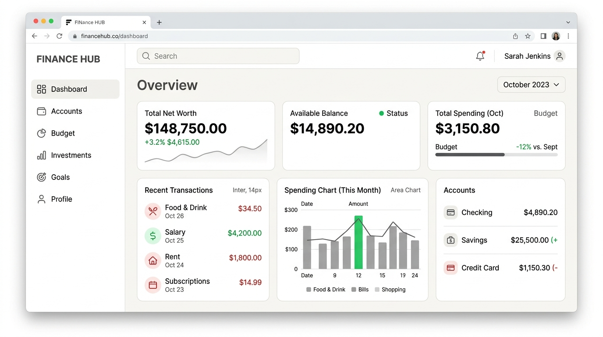

# Expense Tracker

Aplikasi pencatat pemasukan dan pengeluaran untuk mahasiswa. Dibangun dengan Next.js 16 dan Prisma ORM (PostgreSQL).

## Tampilan UI

Berikut adalah gambaran tampilan aplikasi setelah perbaikan desain UI/UX menjadi lebih minimalis, bersih, dan elegan (Glassmorphism & Clean Typography).



## Menjalankan

Cara tercepat (butuh Docker Desktop):

```bash
cp .env.example .env    # PowerShell: Copy-Item .env.example .env
# isi AUTH_SECRET di .env (Opsional jika sudah saya buatkan otomatis)
docker compose up -d db
```

Lalu jalankan instalasi package & migrasi database:

```bash
npm install
npm run db:migrate
```

Untuk memasukkan data dummy (Dummy User & Transactions):
```bash
npx prisma db seed
```

Jalankan server:
```bash
npm run dev
```

Lalu buka `http://localhost:3000`.

## Instruksi Testing Lengkap

Untuk menguji fitur autentikasi dan fungsionalitas utama aplikasi:

**Opsi 1: Buat Akun Baru**
1. Buka `http://localhost:3000/register`.
2. Masukkan nama, email, dan password (minimal 8 karakter, kombinasi huruf & angka).
3. Setelah sukses, Anda akan dialihkan ke `/login`. Silakan login dengan data tersebut.
4. Anda akan masuk ke `Dashboard`. Mulailah menambahkan data melalui menu `Transaksi`!

**Opsi 2: Menggunakan Akun Dummy (Jika sudah menjalankan `npx prisma db seed`)**
1. Buka `http://localhost:3000/login`.
2. Masukkan kredensial berikut:
   - Email: `test@example.com`
   - Password: `password123`
3. Anda akan masuk ke `Dashboard` yang sudah terisi data transaksi, grafik total pemasukan & pengeluaran, serta saldo dummy secara otomatis.
4. Uji coba Filter dan CRUD Transaksi, serta coba ganti *Theme Preference* (Light/Dark mode) dari tombol pojok kanan bawah.

## Perintah

| Perintah | Fungsi |
| --- | --- |
| `npm run dev` | Server development |
| `npm run db:migrate` | Membuat / memperbarui schema database dengan Prisma |
| `npx prisma db seed` | Menjalankan file *seed* untuk memuat data dummy testing |
| `npm run build` lalu `npm start` | Server production |
| `npm run lint` | Cek kode |

## Dokumen

- [docs/PROJEK_WORKFLOW.md](docs/PROJEK_WORKFLOW.md): SRS dan alur kerja tim
- [docs/DATABASE_SETUP.md](docs/DATABASE_SETUP.md): setup PostgreSQL (Docker dan Windows)
- [docs/AUTH_CONTRACT.md](docs/AUTH_CONTRACT.md): cara memakai login, session, dan preferensi
